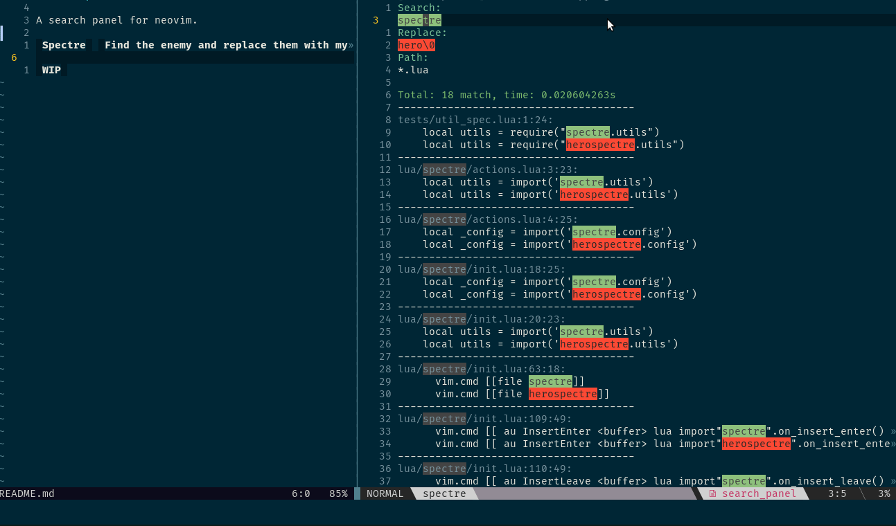

# nvim-spectre
A search panel for neovim.

**Spectre** __find the enemy and replace them with dark power.__

**WIP**


## Why Spectre
* Use regex in search
* I don't need a typeahead function It always search when I type and it is very useless on
search with regex.
* I don't want a floating window with multiple buffer 1 buffer is enough I can move
and check easy.
* A little small tool to replace.

## Installation

``` lua
Plug 'nvim-lua/popup.nvim'
Plug 'nvim-lua/plenary.nvim'
Plug 'windwp/nvim-spectre'
```
## Usage

``` vim
nnoremap <leader>S :lua require('spectre').open()<CR>
"open search current word
vnoremap <leader>S :lua require('spectre').open_visual()<CR>
nnoremap <leader>S viw:lua require('spectre').open_visual()<CR>
"  search in current file
nnoremap <leader>sp viw:lua require('spectre').open_file_search()<cr>

```
You can use dd to delete result item

**WARNING**
* Commit your file before you replace text. It doesn't support undo
* Don't use your crazy vim skill to edit result text or UI

## Regex
* default regex use vim regex **magic mode** `\v` and **ignore-case** . You can
run it on command mode of vim.
* Maybe it has different regex of search command `rg` and replace command
`sed` so careful if you want to replace text.
* Maybe it has a different of hightlight result because I use vim regex to
hightlight text so careful but you can try to replace:)

## TASK
- [x] search
- [x] replace
- [ ] verify text before replace
- [ ] undo 1 and all file
-
## FAQ
* what is Spectre?
> I want create a `Search Panel` but this name is not cool so I get the hero name from
> dota2 game. Spectre has a skill to find enemy on global map so i use it:)
